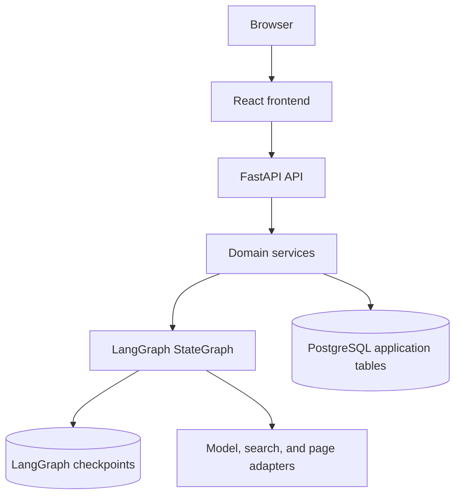
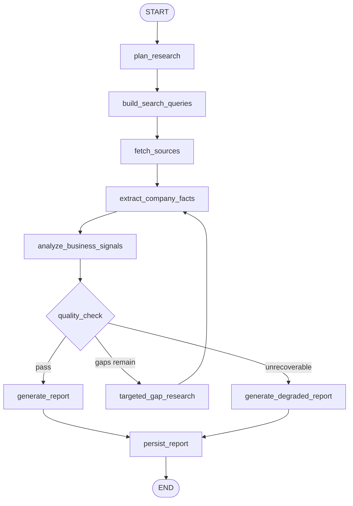

# Architecture

## System Overview

Research Copilot has four runtime parts: React, FastAPI, LangGraph, and PostgreSQL.

## Backend Boundaries

- Routers own request and response contracts.
- Services coordinate sessions, workflow runs, reports, and chat.
- Repositories own database access.
- Integrations hide model, search, and page-fetch providers.
- Workflow modules own graph state, nodes, routing, and report generation.

## LangGraph Workflow

The graph uses shared state, retries, conditional routing, intermediate outputs, and checkpointed thread IDs.

## Persistence

Application tables store sessions, workflow steps, events, reports, sources, and chat messages. LangGraph checkpoints use the session ID as `thread_id`. Tests use SQLite and an in-memory checkpointer; Docker Compose uses PostgreSQL for both application data and checkpoints.

## Progress And Recovery

Workflow events are persisted before they are shown in the browser. The stream endpoint replays existing events, so refreshes and reconnects keep context.

Recovery uses durable thread IDs, bounded retries, quality-gated routing, a resume endpoint, and degraded reports when source coverage is insufficient.

## Local Provider Mode

Default adapters return deterministic search results, source snippets, reports, and chat answers. Setting `MODEL_PROVIDER=openai` routes report and chat generation through the live model adapter and requires `OPENAI_API_KEY` at startup.
