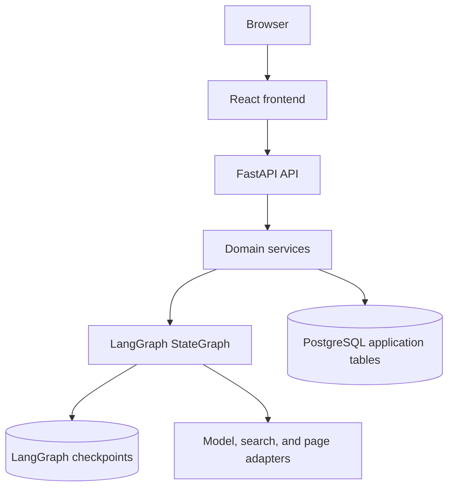

# Architecture

## System Overview

Research Copilot is split into a React frontend, a FastAPI backend, a LangGraph workflow runtime, and PostgreSQL persistence.

## Backend Boundaries

- API routers validate request/response contracts and delegate to services.
- Services coordinate domain behavior, workflow execution, and persistence.
- Repositories own database access and transactions.
- Integrations wrap external model, search, and page-fetching providers.
- Workflow modules own graph state, nodes, routing, and prompts.

## LangGraph Workflow

The graph stores raw research state and intermediate artifacts so progress, recovery, and report quality can be inspected.

## Persistence

Application tables store sessions, workflow events, workflow steps, reports, sources, and chat messages. LangGraph checkpoints store thread-scoped graph snapshots using the session ID as `thread_id`.

## Progress Streaming

The backend persists workflow events before streaming them to the browser through Server-Sent Events. A reconnecting browser can replay historical events and then continue with live updates.

## Recoverability

Each workflow run uses a durable thread ID, bounded retries, node-level error records, quality-gated routing, and degraded report generation for unrecoverable source failures. This preserves useful output even when some external information cannot be fetched.

